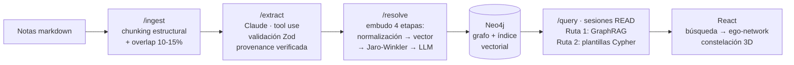

# GrafoKnowledge 🌌

**Constructor de grafo de conocimiento con IA** — lee tus notas markdown, extrae entidades y
relaciones tipadas automáticamente con un LLM, las almacena en un grafo consultable y te deja
hacerle preguntas en lenguaje natural, con cada respuesta anclada a su fuente.

> ¿Conoces el grafo de Obsidian? Imagínalo, pero donde las conexiones **se construyen solas**
> leyendo tus documentos, **tienen significado** (tipos, no solo enlaces) y **puedes hacerle
> preguntas**. Lo que allá es trabajo manual, aquí lo hace la extracción automática.


---

## Cómo funciona



1. **Ingesta:** chunking que respeta la estructura del markdown, con solapamiento para no
   cortar relaciones en las fronteras.
2. **Extracción:** Claude con salida estructurada (tool use); **toda** salida del LLM pasa por
   un único punto de validación Zod, y cada relación debe citar el fragmento exacto que la
   sostiene — la cita se verifica *en código* contra el texto. Lo que no se puede anclar, se
   descarta.
3. **Resolución de entidades:** "Apple", "AAPL" y "Apple Inc" colapsan a un solo nodo mediante
   un embudo de cuatro etapas ordenado de lo gratis a lo caro; el LLM solo adjudica la zona
   gris (~una fracción minoritaria de los casos, logueada).
4. **Consulta:** preguntas en lenguaje natural respondidas desde subgrafos reales (GraphRAG) o
   plantillas Cypher parametrizadas para lo estructural — el LLM **nunca** escribe Cypher libre
   y toda sesión de consulta es read-only a nivel de driver.
5. **Visualización:** revelación progresiva — buscas un concepto, ves su ego-network como una
   constelación 3D, expandes, descubres conexiones que no sabías que existían.

## Decisiones de ingeniería

Las decisiones viven como ADRs en el [SAD](SAD-grafoknowledge.md) — diseño y porqué, con lo
que cada decisión sacrifica. Las que definen el proyecto:

- **Anti-alucinación por diseño, no por prompt** (ADR-003): provenance obligatoria y
  verificada en código. Un grafo que miente es peor que no tener grafo.
- **Embudo de resolución que acota el costo** (ADR-004): match normalizado → búsqueda
  vectorial O(log N) → Jaro-Winkler → LLM solo en zona gris, con guardas contra falsos
  merges (nunca entre tipos distintos, nunca acrónimos).
- **El LLM nunca escribe Cypher** (ADR-005): dos rutas de consulta + sesiones READ a nivel
  de protocolo. La seguridad no depende de un regex.
- **Las notas son documentos vivos** (ADR-009): re-ingesta idempotente por hash de chunk —
  editar una nota actualiza el grafo sin dejar relaciones huérfanas.
- **Node/TS y no Python** (ADR-001): el workload es orquestación I/O-bound de LLM + DB,
  terreno fuerte de Node; tipado estricto de punta a punta.
- **Dominios como configuración** (ADR-008): el motor no conoce el dominio. PKM es el
  primero; el segundo entra por config, no por código.

## Quick start

Requisitos: Node ≥ 22, Docker, y API keys de [Anthropic](https://console.anthropic.com) y
[Google AI](https://aistudio.google.com) (solo para las fases de extracción/resolución).

```bash
git clone https://github.com/faborubio/grafoknowledge.git
cd grafoknowledge
cp .env.example .env      # completar keys (nunca van al repo)
npm install
npm run db:up             # Neo4j en Docker — Browser en http://localhost:8474
npm run db:init           # constraints + índice vectorial (idempotente)
npm run dev               # backend :3001 + frontend :5173
```

## Estructura

```
backend/src/
  ingest/     # loaders markdown + chunking con overlap        (Fase 1)
  extract/    # extracción Claude + esquemas Zod + provenance  (Fase 1)
  resolve/    # embudo de resolución de entidades              (Fase 2)
  graph/      # cliente Neo4j · MERGE canónico · sesiones READ
  query/      # router: GraphRAG + plantillas Cypher           (Fase 3)
  schema/     # dominios como config tipada (PKM primero)
  evals/      # gates de costo + dataset dorado                (Fases 0-5)
frontend/     # React + Vite + Tailwind (constelación 3D en Fase 4)
```

## Roadmap

| Fase | Entrega | Estado |
|---|---|---|
| 0 | Fundación: scaffold, Neo4j, esquema PKM, gates | 🔨 En curso |
| 1 | Pipeline de extracción con provenance | ⬜ |
| 2 | Resolución de entidades (el muro) | ⬜ |
| 3 | Q&A en lenguaje natural (dos rutas) | ⬜ |
| 4 | Visualización "constelación de conocimiento" | ⬜ |
| 5 | Evals (precisión/recall/costo) + demo pública | ⬜ |
| 6 | v2: segundo dominio por config | ⬜ solo con tracción |

## Documentación

- [SAD](SAD-grafoknowledge.md) — arquitectura, ADRs, gates, modelo de datos. **Fuente de verdad.**
- [CLAUDE.md](CLAUDE.md) — cómo retomar el proyecto en 5 minutos.
- [docs/](docs/) — deuda técnica (AUDIT), casos del dominio (CASES), incidentes (TROUBLESHOOTING).

El proyecto sigue un método propio de ingeniería (SAD + ADRs + deuda visible + entrega por
fases con Definition of Done); estos documentos no son decorado — son el sistema de trabajo.

---

**Autor:** [faborubio](https://github.com/faborubio)
